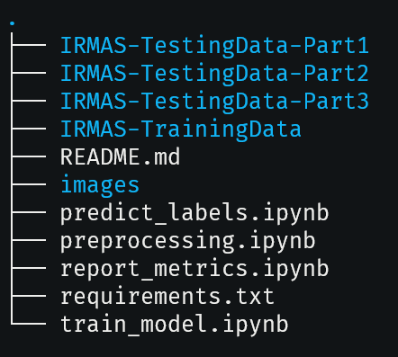

# Music Instrument Detection
This is a machine learning project to detect and classify musical instruments played in an audio file.  
The project uses a CNN model to detect 11 types of musical instruments:
|  Instrument | Label  |
|---|---|
| Cello  |  cel |
| Clarinet  | cla  |
| Flute | flu |
| Acoustic Guitar | gac |
| Electric Guitar | gel |
| Organ | org |
| Piano | pia |
| Saxophone | sax |
| Trumpet | tru |
| Violin | vio |
| Voice | voi |

## Authors
Abhijith Gururaj, Thomas Stapor, Akhil Palla

## Code Layout
The project comprises of four main jupyter notebooks:
1. preprocessing.ipynb - Performs the preprocessing stage of the IRMAS dataset. This notebook will produce the following datasets: X_train.npy, y_train.npy, X_val.npy, y_val.npy, X_test.pkl and y_test.pkl. These files are necessary for the execution of train_model.ipynb
2. train_model.ipynb - Creates and trains the CNN model using the datasets created by preprocessing.ipynb. This notebook will create a **model.h5** file that represents the trained and optimized model with minimal validation loss.
3. predict_labels.ipynb - Uses the model.h5 file created by train_model.ipynb to predict the labels from X_test.pkl dataset. This will create a file called **predictions**that contains all the predictions of the model against the test dataset.
4. report_metrics.ipynb - Uses the predictions file to compare and compute accuracy and f-1 scores of the instrument classes and plots these metrics.

All these notebooks should be run in successive order for training, predicting and reporting the performance of the model.

## System Requirements
The notebooks require at least 12GB RAM for execution.
The required python packages for this project are present in requirements.txt

## Instructions to execute and evaluate the model
The project requires the IRMAS Dataset which is available here: https://zenodo.org/records/1290750  
Please download the following zip files from the above link:
1. IRMAS-TrainingData.zip
2. IRMAS-TestingData-Part1.zip
3. IRMAS-TestingData-Part2.zip
4. IRMAS-TestingData-Part3.zip

After extracting the above zip files, the codebase should have the following directory structure before execution:  
  

## Please download and extract the dataset according to the directory structure above.
## Note: if you have any trouble in creating the data files due to kernel crash, please restart jupyter and the python kernel.
## If you have any trouble with downloading the IRMAS dataset, We have already pushed the necessary test data files required for training the model
X_train.npy, y_train.npy, X_val.npy, y_val.npy, X_test.pkl and y_test.pkl.
If you want to avoid downloading the dataset, please ensure the above *.npy and *.pkl files are present and proceed with executing the second notebook (train_model.ipynb).  

If you do not wish to download the IRMAS dataset and still do not see *.npy and *.pkl data files, then probably git-lfs is not enabled. You can try one these two options:
1. install git-lfs in your system and then clone this repository OR
2. Manually browse to each datafile in this github repository and download the raw file over HTTP.
Once these files are either cloned/downloaded, you can proceed with executing the second notebook. (train_model.ipynb)

Please ensure the system requirements are satisfied and execute the notebooks in the following order:
1. preprocessing.ipynb
2. train_model.ipynb
3. predict_labels.ipynb **Please close jupyter and restart kernel before running predict_labels.ipynb. Sometimes it crashes the kernel.**
4. report_metrics.ipynb

The report_metrics.ipynb should display the accuracy and f1-score metrics of the CNN model. 